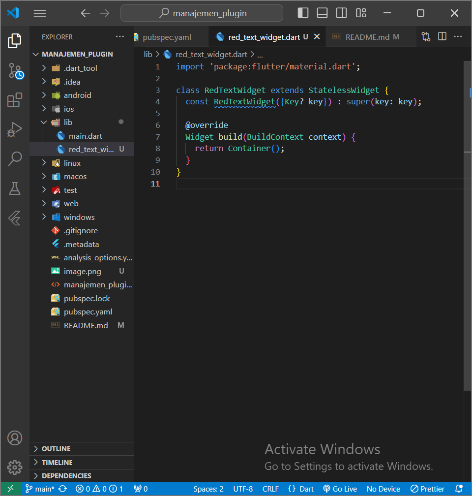
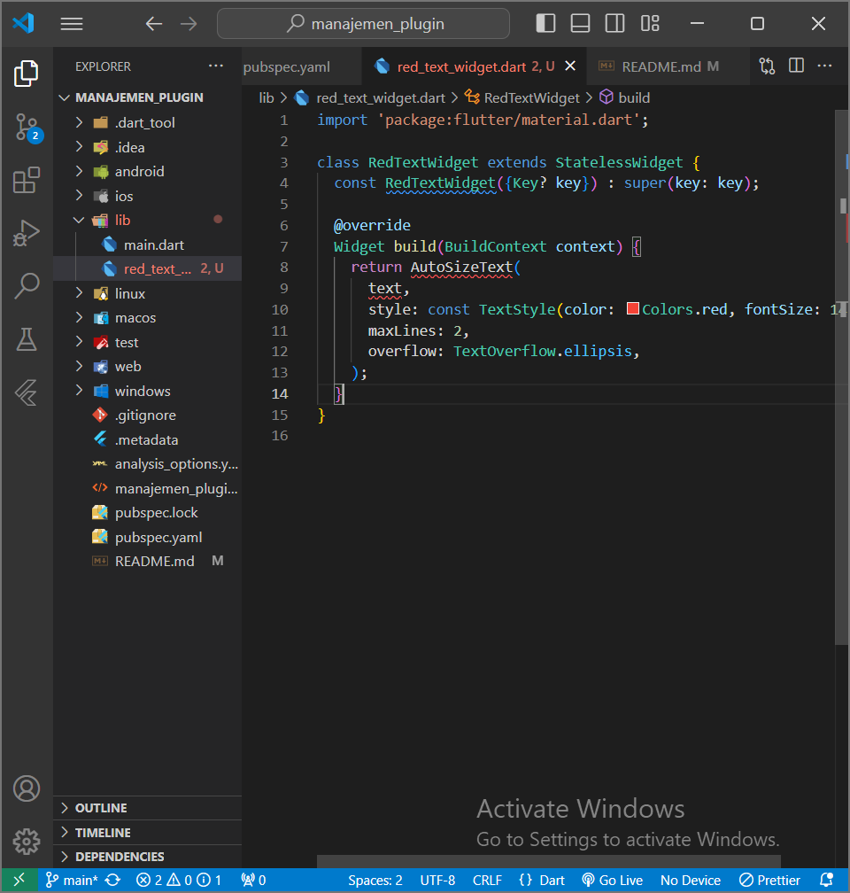
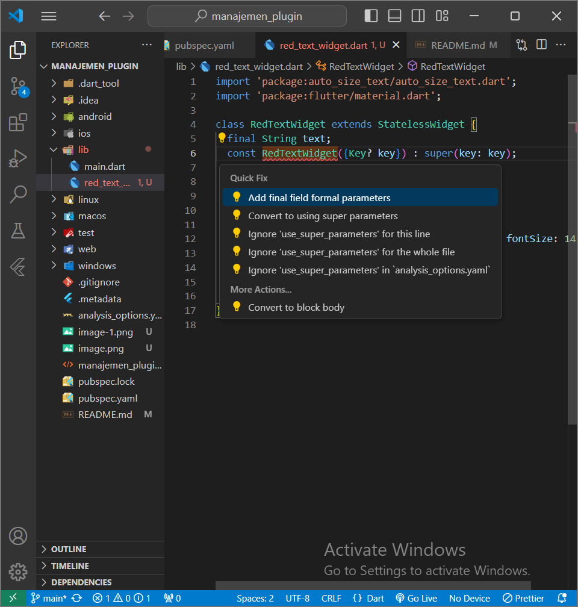
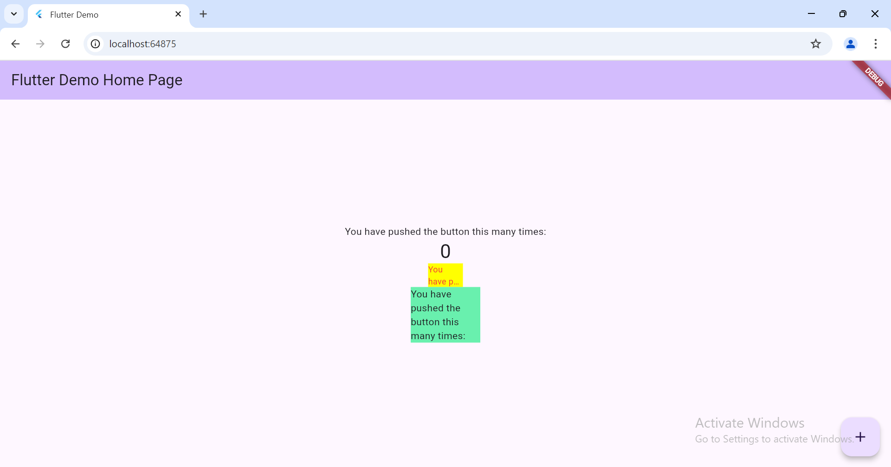

# manajemen_plugin

Jika error tambahkan import auto_size_text nya dan tambahkan field formal parameternya (required)

menambahkan variabel text dan parameter di constructor

hasil

Camera

Hasil filter

Maksud void async adalah berfungsi sebagai mekanisme untuk mendefinisikan operasi asynchronous yang tidak menghasilkan hasil.

